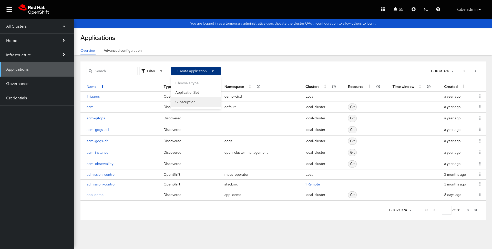
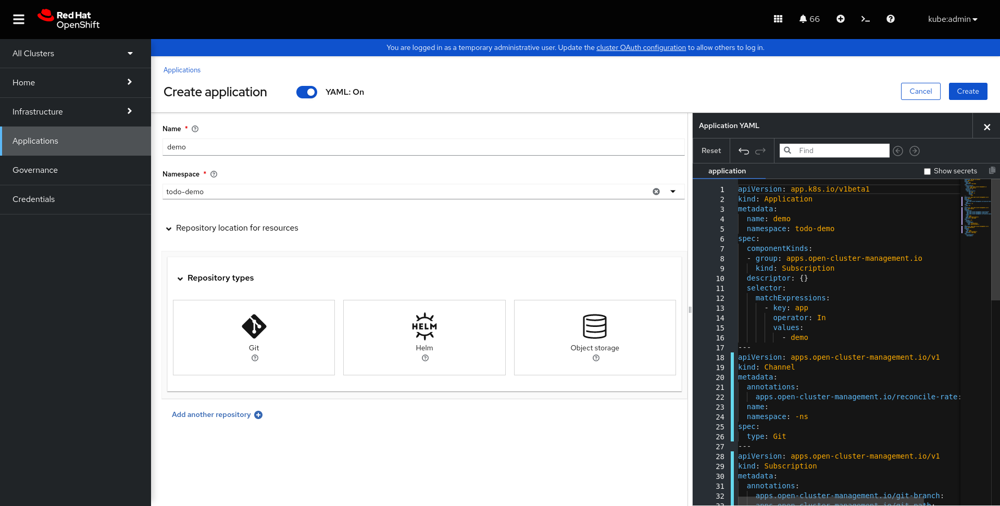
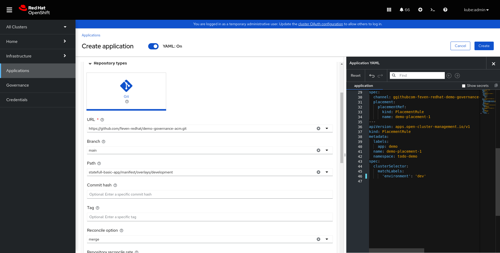
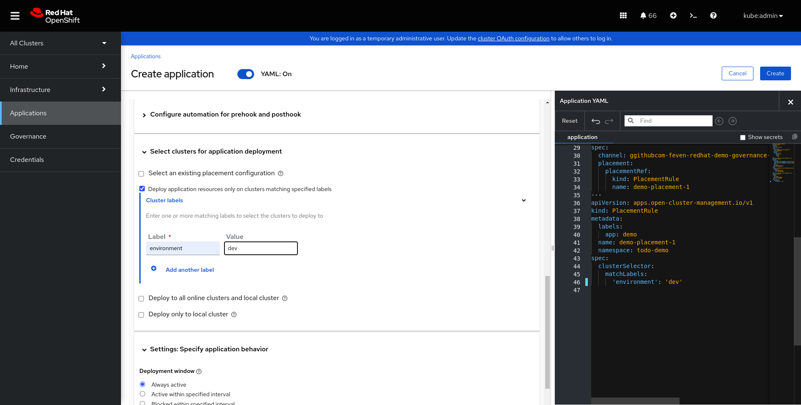
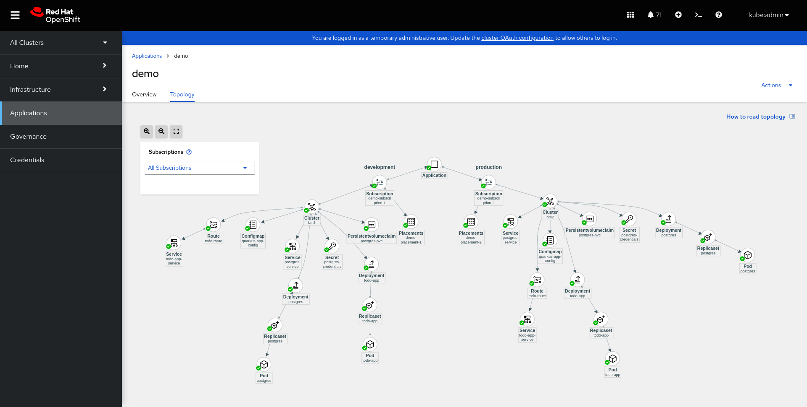
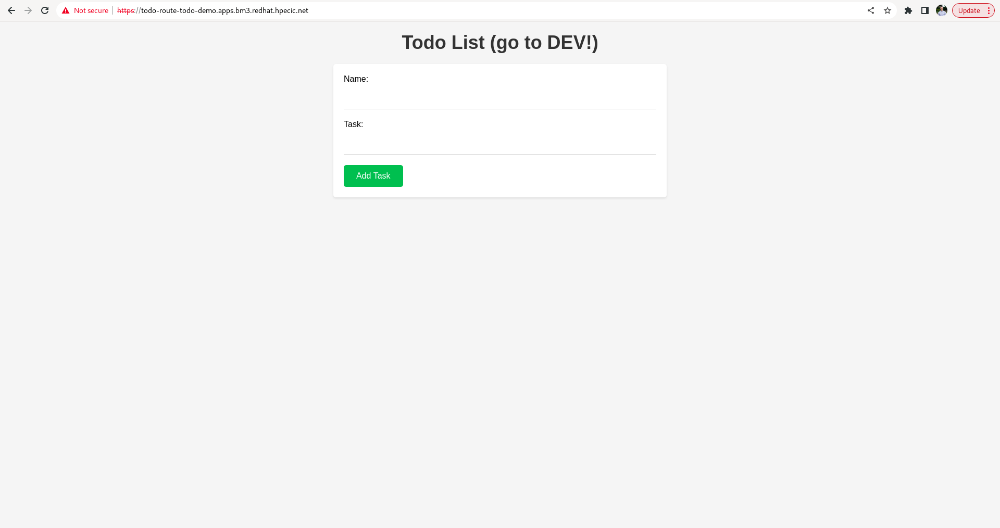
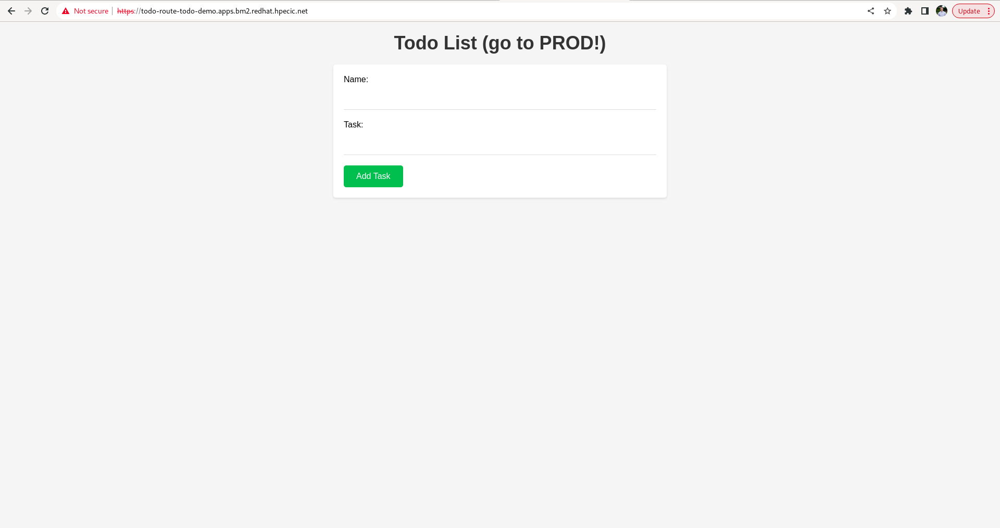
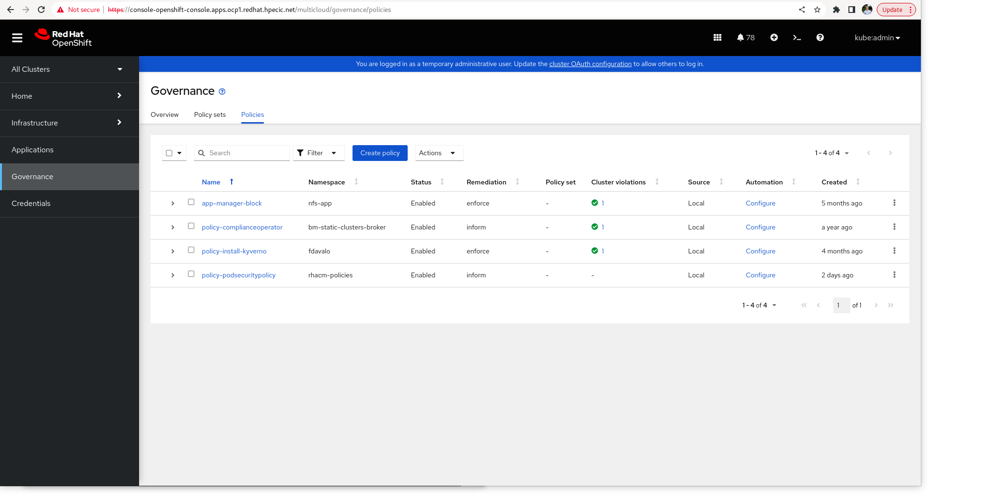

# Deploying Applications Across Multiple Clusters with RHACM     

## Prepare
Add label cluster bm2 environment=dev 
Add label cluster bm3 environment=prod 

## Demo

On the left navigation bar, navigate to Applications, click Create application, and
then click Subscription.



In both the Name and Namespace fields, type todo-demo. Applications from the local hub
cluster require a namespace for every application to contain application resources on
the managed clusters.



 Click Repository location for resources and select Git for the repository type for your
deployable resources.

Complete the following fields

| Field Name     | Value                          |
|----------------|--------------------------------|
| URL          | https://github.com/feven-redhat/demo-governance-acm.git       |
| Branch     | main              |
| Path | statefull-basic-app/manifest/overlays/development |



Then in the Select clusters for application deployment section 

| Label    | Value                          |
|----------------|--------------------------------|
| environment          | dev   |



Then click on Add another repository

and repeat the same step by changing overlays and the label

Complete the following fields

| Field Name     | Value                          |
|----------------|--------------------------------|
| URL          | https://github.com/feven-redhat/demo-governance-acm.git       |
| Branch     | main              |
| Path | statefull-basic-app/manifest/overlays/production |

Then in the Select clusters for application deployment section 

| Label    | Value                          |
|----------------|--------------------------------|
| environment          | prod   |


After few seconds you can see the topology view


And check that you have your application on both cluster






# Deploying and Managing Policies for Multiple Clusters with RHACM        
## Prepare

NOTE: switch to bm3

Update ca certificate to have an EOF < 1000 hours (for demo purpose)

```shell
short-new-certificate.sh
```

```shell
openssl s_client -connect test.apps.bm3.redhat.hpecic.net:443 -showcerts </dev/null 2>/dev/null | openssl x509 -noout -enddate
```

## Demo

NOTE: switch back to ocp1

Create the namespace for the policies and the placementrules

```shell
oc apply -f manifest/namespaces.yaml
```


```shell
oc apply -f manifest/placementrule.yml
```


Click Governance on the left pane to navigate to the governance dashboard. Then, click Create policy. The Create policy page displays.



Complete the fields as follow:

| Field Name     | Value                          |
|----------------|--------------------------------|
| Name           | policy-certificatepolicy       |
| Namespace      | policy-governance              |
| Specifications | CertificatePolicy - Certificate management expiration |
| Remediation    | Inform                         |


On the right side of the Create policy page, edit the YAML code as follows:

```shell
spec:
  remediationAction: inform
  disabled: false
  policy-templates:
    - objectDefinition:
        apiVersion: policy.open-cluster-management.io/v1
        kind: CertificatePolicy
        metadata:
          name: policy-certificatepolicy-cert-expiration
        spec:
          namespaceSelector:
            include:
              - default
              - openshift-console
              - openshift-ingress
            exclude:
              - kube-*
          remediationAction: inform
          severity: low
          minimumDuration: 1000h
```

Click create


go back to default certificate
```shell
default-ingress-certificate.sh
```


# clean

Delete Polocy policy-certificatepolicy in the console
